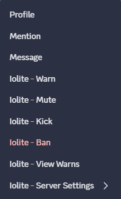
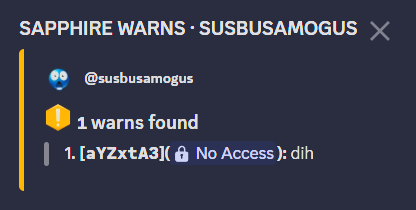
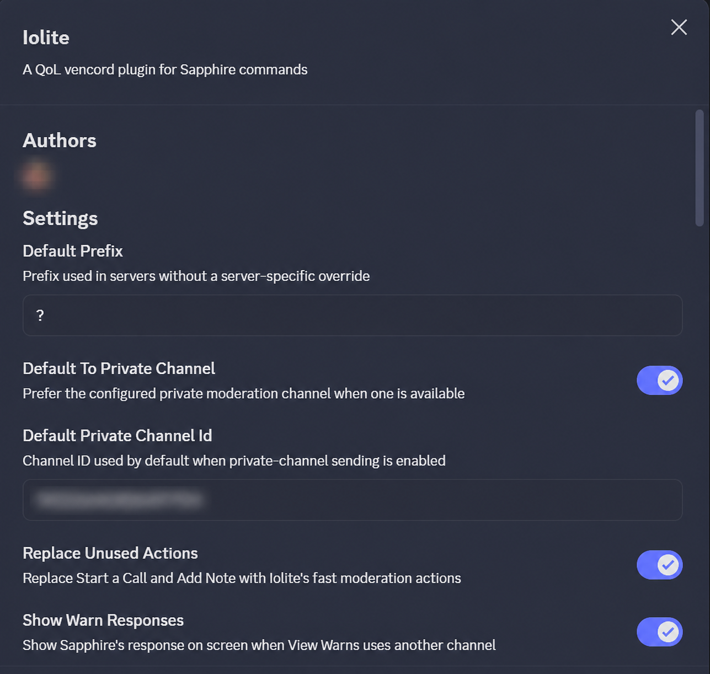
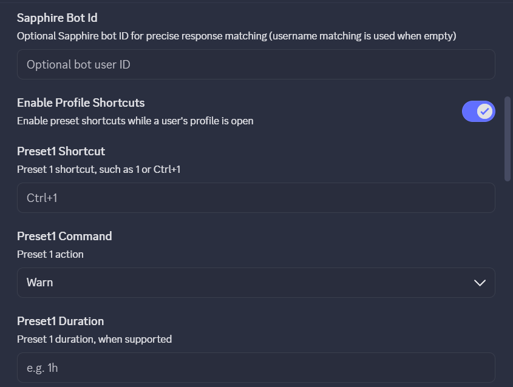

# Iolite

**Pronounced:** “EYE-uh-lite”

Iolite is a QoL [Vencord](https://vencord.dev) plugin for [Sapphire](https://sapph.xyz) commands. It provides fast moderation actions without opening a screen-blocking modal.

> [!IMPORTANT]
> Iolite is a custom user plugin. It is not part of Vencord's approved built-in plugin collection. Manual installations require building Vencord from source, while the Windows release includes a pinned prebuilt Vencord runtime. Client modifications are against Discord's Terms of Service; use them at your own discretion.

## Features

- Use clearly labeled moderation and lookup actions directly from a user's or message's context menu—no Iolite dropdown.
- Reorder those actions separately for profile and message menus with a visual drag-and-drop editor, or move actions such as Ban into Hidden.
- Optionally replace **Start a Call** and **Add Note** with the fast moderation rows.
- Enter a reason and optional duration in a small floating editor while the rest of Discord stays usable.
- Reuse the eight most recent successful ban and mute reasons from the matching moderation popup.
- Send to the current channel or a configured private moderation channel.
- Show complete Sapphire Warns, User Info, and Cases responses in an isolated multi-embed panel.
- Review a member's recent messages from the same bottom-right panel and jump directly to any result.
- Automatically close lookup panels after a configurable delay that pauses on hover, keyboard focus, or when Discord is not active.
- Relay Sapphire's recent-punishment confirmation buttons into the bottom-right panel without repeating the command.
- Configure three named presets with an action, duration, reason, destination, and shortcut. Matching presets also appear as buttons in moderation popups.
- Customize the popup with one solid hex color or a two-color diagonal gradient.
- Store a different Sapphire prefix for each server.
- Add Sapphire's `-r` punishment-review flag.

## Screenshots

| Fast actions | Background warning lookup |
| --- | --- |
|  |  |
| Plugin settings | Keyboard preset settings |
|  |  |

The screenshots redact private identifiers and avatars. `susbusamogus` is a consented demo account.

## Supported Sapphire commands

Iolite follows Sapphire's [official moderation command reference](https://docs.sapph.xyz/#/moderation?id=commands-overview):

```text
ban [user] [duration] [reason] [-r]
kick [user] [reason] [-r]
mute [user] [duration] [reason] [-r]
warn [user] [duration] [reason] [-r]
warns [user]
```

Iolite also provides configurable **User Info** and **Cases** lookups. Their default command names are `userinfo` and `cases`; change the global names in Iolite's settings or override either name from **Iolite - Server Settings** when a server uses a different Sapphire command or alias.

Sapphire supports server-defined prefixes. Iolite defaults to `?`, and the prefix can be changed separately for each server from its context menu.

## Plugin Browser and installation

Iolite does not appear as a discoverable plugin in a standard Vencord installation. After the Windows installer or a manual source build adds it, Iolite appears in **Settings → Vencord → Plugins** and can be enabled normally.

The [full installation guide](INSTALL.md) covers:

- installing the Windows release into standard or source-built Vencord;
- installing Vencord and Iolite from scratch;
- moving from normal/prebuilt Vencord without intentionally losing existing plugin settings;
- adding Iolite alongside other custom plugins;
- Vesktop, updates, removal, and troubleshooting.

For most Windows users, the recommended route is the latest `IoliteSetup-...exe` from the public [Releases page](https://github.com/Epiano7/iolite-vencord/releases). It uses a managed runtime for standard Vencord, or detects an active source build and compiles Iolite beside its existing user plugins. Source integration requires Node.js and pnpm; the manual guide remains available when the automatic source path cannot be used.

The installer follows the Windows app theme automatically, including a dark interface when Windows is set to dark mode.

## Configuration

Right-click a member inside a server and open **Iolite - Server Settings**.

- **Prefix for this server:** Enter `?`, `!`, `s!`, or that server's configured Sapphire prefix.
- **Private moderation channel ID:** Enable Discord Developer Mode, right-click the private channel, and select **Copy Channel ID**.
- **Default private destination:** Enable **Default To Private Channel** in Iolite's normal Vencord plugin settings, then enter the destination in **Default Private Channel ID**.

Iolite verifies that the configured private destination belongs to the current server. A server-specific channel ID set from the context menu overrides the default channel ID.

### Keyboard presets

Open Iolite's normal Vencord settings and configure the name, action, duration, reason, destination, and optional shortcut for **Preset 1**, **Preset 2**, or **Preset 3**. A shortcut can be a single key such as `1` or a combination such as `Ctrl+1`. Presets whose action matches the open moderation popup appear there as buttons; selecting one fills its duration, reason, and destination for review before sending.

Left-click a member to open their profile, then press the configured shortcut. Iolite ignores preset shortcuts while you are typing in chat, a reason field, or another text input. A private preset fails safely instead of sending publicly when its private channel is unavailable.

### Saved reasons and panel colors

With **Remember Recent Reasons** enabled, Iolite stores the eight most recent successful ban reasons and eight most recent successful mute reasons locally in Vencord's settings. Use **Choose a recent reason…** in the matching popup to reuse one. Reasons are only remembered after Sapphire's command is sent successfully; use **Clear saved ban and mute reasons** to erase the history.

Set **Quick Panel Color 1** to a six-digit hex color such as `#111214` for a solid popup. Set **Quick Panel Color 2** as well to create a diagonal two-color gradient. Invalid or empty values safely fall back to Iolite's standard Discord-like dark or light panel.

### Sapphire lookup panels

**Iolite - View Warns**, **Iolite - View User Info**, and **Iolite - View Cases** use one response system. Iolite waits for Sapphire's reply and renders every returned embed in an isolated on-screen panel, including titles, descriptions, fields, colors, thumbnails, images, and footers. It checks the destination channel, Sapphire identity, response time, and available target mentions before accepting a response.

The panel closes after five seconds by default. Hovering it, focusing anything inside it, switching away from Discord, or hiding the window pauses the countdown without resetting it. Set **Lookup Panel Timeout Seconds** to `0` to keep lookup panels open until manually closed. If a server uses a differently named Sapphire application, enter its bot user ID in **Sapphire Bot ID** for exact matching.

Enable or disable message right-click actions with **Enable Message Actions**. Server-specific User Info and Cases command names are available under **Iolite - Server Settings**.

### Right-click menu editor and recent messages

Open Iolite's normal Vencord settings and use **Right-click Menu Layout**. Choose the Profile or Message tab, then drag rows to set their top-to-bottom order. Drag an action into **Hidden** to remove it from that menu, or drag it back into **Visible actions** to restore it. The two layouts are independent, while **Iolite - Server Settings** remains pinned to the profile menu so configuration cannot become unreachable.

**Iolite - Recent Messages** opens in the bottom-right without changing channels. It searches the current server by default, can be narrowed to the current channel, supports loading more results, and offers a **Jump** button for messages still accessible to the moderator. Iolite uses Discord's own message-search response and does not build or retain a separate message-history database.

### Recent-punishment confirmations

When Sapphire asks whether to continue because a recent punishment already exists, Iolite mirrors Sapphire's real buttons in the bottom-right panel. Selecting one submits the original message-component interaction and immediately locks the panel against double clicks; it never repeats the punishment command. Use **Open original Sapphire message** if the interaction expires or Discord rejects it. This behavior can be disabled with **Relay Sapphire Confirmations** in Iolite's settings.

## Compatibility monitoring

The repository's scheduled GitHub Actions workflow checks Iolite against the latest Vencord source every Monday and can also be run manually. A failed check means the plugin may need an update; it does not automatically change or publish plugin code.

## Development checks

Place this repository at `Vencord/src/userplugins/iolite`, then run from the Vencord root:

```powershell
pnpm exec eslint src/userplugins/iolite/index.tsx src/userplugins/iolite/QuickPanel.tsx src/userplugins/iolite/MenuEditor.tsx
pnpm testTsc
pnpm build
```

## Credits

- **Epiano7** — creator and maintainer.
- **Eoka** — feature prototypes and design contributions.

## License

Iolite is licensed under GPL-3.0-or-later. See [LICENSE](LICENSE).
